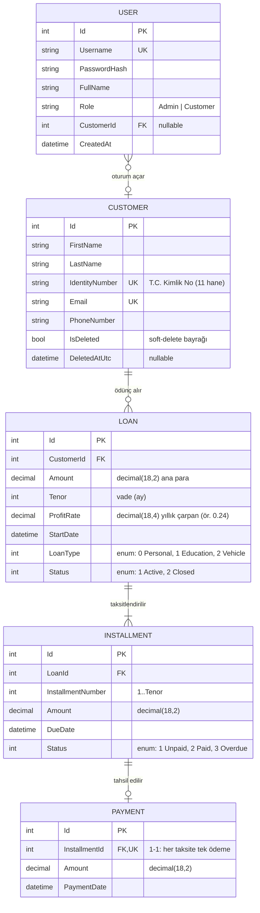

# ER Diyagramı — Loan Management System

Bu dokümanda `LoanManagement.DataAccess` tarafından yönetilen `LoanDb` veritabanının varlık ilişkileri açıklanır. Diyagram Mermaid `erDiagram` notasyonu ile yazılmıştır; GitHub ve modern IDE'ler bunu doğrudan render eder.

---

## 1. Genel Bakış

Sistem dört çekirdek varlığı + bir kimlik varlığını yönetir:

| Varlık | Açıklama |
|---|---|
| **Customer** | CRM kaydı — kredi müşterisi (Ad, Soyad, T.C. Kimlik No, e-posta, telefon). |
| **Loan** | Müşteriye verilen kredi (ana para, vade, kar oranı, kredi türü, durum). |
| **Installment** | Kredi taksiti (sıra no, tutar, vade tarihi, durum). |
| **Payment** | Bir taksite karşılık gelen ödeme kaydı (tutar, tarih). |
| **User** | Sisteme giriş yapan kullanıcı (kullanıcı adı, parola hash'i, rol, opsiyonel `CustomerId`). |

İlişkiler:

- `Customer` **1 ── N** `Loan`
- `Loan` **1 ── N** `Installment`
- `Installment` **1 ── 1** `Payment` (opsiyonel; taksit ödenince oluşur)
- `User` **N ── 1** `Customer` (opsiyonel; admin kullanıcılar için `CustomerId = NULL`)

---

## 2. Mermaid ER Diyagramı



---

## 3. Klasik (Crow's-Foot) Diyagram

Mermaid'i render edemeyen ortamlar için sade bir gösterim:

```
┌──────────────┐  1     N  ┌──────────────┐  1     N  ┌────────────────┐  1     0..1  ┌──────────────┐
│   Customer   │──────────<│     Loan     │──────────<│  Installment   │─────────────<│   Payment    │
│ Id (PK)      │           │ Id (PK)      │           │ Id (PK)        │              │ Id (PK)      │
│ FirstName    │           │ CustomerId FK│           │ LoanId FK      │              │ InstallmentId│
│ LastName     │           │ Amount       │           │ InstallmentNo  │              │   FK, UK     │
│ IdentityNo UK│           │ Tenor        │           │ Amount         │              │ Amount       │
│ Email UK     │           │ ProfitRate   │           │ DueDate        │              │ PaymentDate  │
│ PhoneNumber  │           │ StartDate    │           │ Status         │              └──────────────┘
│ IsDeleted    │           │ LoanType     │           └────────────────┘
│ DeletedAtUtc │           │ Status       │
└──────────────┘           └──────────────┘
        ▲
        │ 0..1 (CustomerId nullable)
        │
┌──────────────┐
│    User      │
│ Id (PK)      │
│ Username UK  │
│ PasswordHash │
│ FullName     │
│ Role         │
│ CustomerId FK│
│ CreatedAt    │
└──────────────┘
```

Notasyon: `──────<` = "bir tarafa N tanesi bağlanır".

---

## 4. İlişki Kuralları (EF Core `OnModelCreating`)

`LoanDbContext` üzerinde tanımlı kurallar:

| İlişki | Konfigürasyon | Açıklama |
|---|---|---|
| `Customer` 1─N `Loan` | `HasMany(c => c.Loans).WithOne(l => l.Customer).HasForeignKey(l => l.CustomerId)` | Klasik master-detail. |
| `Loan` 1─N `Installment` | `HasMany(l => l.Installments).WithOne(i => i.Loan).HasForeignKey(i => i.LoanId)` | Taksitler kredi oluşturulurken otomatik üretilir. |
| `Installment` 1─1 `Payment` | `HasOne(i => i.Payment).WithOne(p => p.Installment).HasForeignKey<Payment>(p => p.InstallmentId)` | Bir taksite tek ödeme kaydı; FK aynı zamanda **benzersizdir**. |
| `User` N─1 `Customer` | `HasOne(u => u.Customer).WithMany().HasForeignKey(u => u.CustomerId).OnDelete(DeleteBehavior.Restrict)` | Admin kullanıcılarda `CustomerId = NULL`. |
| **Global query filter** | `Customer`: `c => !c.IsDeleted` ve `Loan`: `l => l.Customer != null && !l.Customer.IsDeleted` | Soft-delete edilmiş müşteri ve kredileri varsayılan sorgularda gizler. |

---

## 5. Tip / Kolon Detayları

| Alan | SQL Tipi | Not |
|---|---|---|
| `Loan.Amount`, `Installment.Amount`, `Payment.Amount` | `decimal(18,2)` | Para birimi alanları. |
| `Loan.ProfitRate` | `decimal(18,4)` | DB'de yıllık **çarpan** (örn. 0,2400 = %24). API katmanı yüzde (0–100) alır. |
| `Customer.IdentityNumber` | `nvarchar` + `[TurkishIdentityNumber]` validatörü | 11 hane TC Kimlik kontrolü uygulanır. |
| `Customer.PhoneNumber` | `[TurkishPhoneNumber]` | Opsiyonel, Türkiye GSM formatı. |
| `Installment.DueDate` | `datetime` | `StartDate + n ay` (1 ≤ n ≤ Tenor). |
| `Loan.Status`, `Installment.Status`, `Loan.LoanType` | `int` | Bkz. enum tanımları (`Enums.cs`). |

### Enumlar

```
LoanType        : Personal(0) | Education(1) | Vehicle(2)
LoanStatus      : Active(1)   | Closed(2)
InstallmentStatus: Unpaid(1)  | Paid(2)   | Overdue(3)
```

---

## 6. Yaşam Döngüsü Notları

1. **Müşteri oluşturulur** → `Customers` tablosuna `IsDeleted = false` ile yazılır.
2. **Kredi başvurusu** geldiğinde:
   - `Customer` var mı? → kredi skoru çek (mock Findeks) → skor ≥ 600 ise ilerle.
   - `Loan` kaydı + `Tenor` adet `Installment` kaydı **tek transaction**'da oluşur.
3. **Ödeme**: `Payments` tablosuna kayıt eklenir, ilgili `Installment.Status = Paid` olur. Tüm taksitler ödendiğinde `Loan.Status = Closed`.
4. **Soft-delete**: Aktif kredisi olan müşteri silinemez. Silindiğinde `IsDeleted = true`, `DeletedAtUtc = UTC now`; restore ile geri açılır.

---

## 7. İlgili Dosyalar

- Veri modeli: `backend/LoanManagement.Entities/Models/{Customer,Loan,Installment,Payment,User}.cs`
- Enumlar: `backend/LoanManagement.Entities/Enums/Enums.cs`
- DbContext: `backend/LoanManagement.DataAccess/Context/LoanDbContext.cs`
- Migrations: `backend/LoanManagement.DataAccess/Migrations/`
