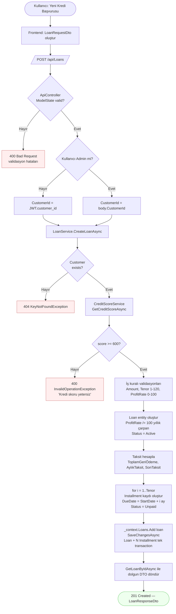
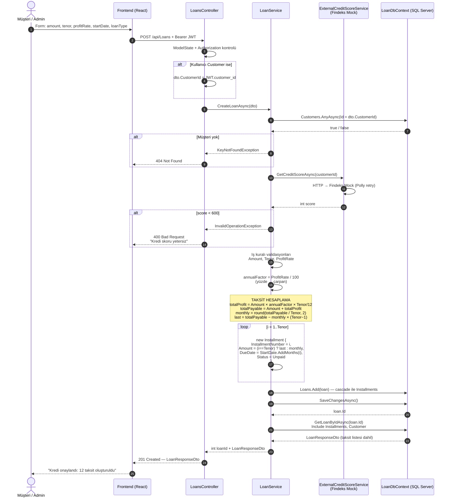

# Kredi Oluşturma → Taksit Üretme Akışı

`LoanService.CreateLoanAsync` metodu üzerinden gerçekleşen "müşteri kredi başvurusu yapar → sistem taksitleri otomatik üretir" akışının uçtan uca dokümantasyonudur.

İlgili kaynak: `backend/LoanManagement.Business/Services/LoanService.cs`

---

## 1. Üst Düzey Akış (Flowchart)



---

## 2. Sıralı Diyagram (Sequence)



---

## 3. Taksit Hesaplama Detayı

`LoanService.CreateLoanAsync` içindeki algoritma:

```csharp
// loan.ProfitRate burada YILLIK ÇARPAN (örn. 0.24)
decimal totalProfit  = loan.Amount * loan.ProfitRate * ((decimal)loan.Tenor / 12m);
decimal totalPayable = loan.Amount + totalProfit;
decimal monthlyAmount       = Math.Round(totalPayable / loan.Tenor, 2);
decimal lastInstallmentAmount = totalPayable - (monthlyAmount * (loan.Tenor - 1));

for (int i = 1; i <= loan.Tenor; i++)
{
    loan.Installments!.Add(new Installment
    {
        InstallmentNumber = i,
        Amount = (i == loan.Tenor) ? lastInstallmentAmount : monthlyAmount,
        DueDate = loan.StartDate.AddMonths(i),
        Status  = InstallmentStatus.Unpaid
    });
}
```

### Örnek Hesaplama

> **Girdi:** `Amount = 60.000 ₺`, `Tenor = 12`, `ProfitRate = 24 (%24)`, `StartDate = 2026-06-01`

| Adım | Hesap | Sonuç |
|---|---|---|
| 1 | `annualFactor = 24 / 100` | `0,24` |
| 2 | `totalProfit = 60.000 × 0,24 × (12/12)` | `14.400 ₺` |
| 3 | `totalPayable = 60.000 + 14.400` | `74.400 ₺` |
| 4 | `monthly = Round(74.400 / 12, 2)` | `6.200,00 ₺` |
| 5 | `last = 74.400 − 6.200 × 11` | `6.200,00 ₺` |

Üretilen taksitler:

| # | Vade Tarihi | Tutar | Durum |
|---|---|---|---|
| 1 | 2026-07-01 | 6.200,00 ₺ | Unpaid |
| 2 | 2026-08-01 | 6.200,00 ₺ | Unpaid |
| 3 | 2026-09-01 | 6.200,00 ₺ | Unpaid |
| … | … | … | … |
| 11 | 2027-05-01 | 6.200,00 ₺ | Unpaid |
| 12 | 2027-06-01 | 6.200,00 ₺ | Unpaid |

> Yuvarlama nedeniyle son taksit farklı olabilir; algoritma kuruş farkını **son takside** toplar. Örn. 7 ay vadeyle 60.000 ₺ + %24 gibi tam bölünmeyen senaryoda 11 taksit `monthly`, son taksit `monthly ± kuruş` olur.

---

## 4. ProfitRate Birim Dönüşümü

| Katman | Birim | Örnek |
|---|---|---|
| API isteği (`LoanRequestDto.ProfitRate`) | Yüzde (`0–100`) | `24` (= %24) |
| Servis içi hesaplama | Yıllık çarpan | `0.24` |
| Veritabanı (`Loan.ProfitRate`) | Yıllık çarpan, `decimal(18,4)` | `0.2400` |
| API yanıtı (`LoanResponseDto.ProfitRate`) | Yüzde (`0–100`), 4 ondalığa yuvarlı | `24.0000` |

Dönüşüm `LoanService.CreateLoanAsync` (giriş) ve `LoanService.MapToDto` (çıkış) içinde tek noktada yapılır.

---

## 5. Validasyon ve Hata Senaryoları

| Sıra | Kontrol | Hata | HTTP |
|---|---|---|---|
| 1 | Bearer JWT geçerli mi? | `Microsoft Authentication` | `401` |
| 2 | Customer rolünde mi + `customer_id` claim'i var mı? | "Kredi oluşturmak için müşteri hesabı gereklidir." | `403` |
| 3 | `ModelState.IsValid` | DataAnnotations + `IValidatableObject` | `400` |
| 4 | Müşteri DB'de var mı? | `KeyNotFoundException` "Müşteri bulunamadı." | `404` |
| 5 | Kredi skoru ≥ 600 mü? | `InvalidOperationException` "Kredi skoru yetersiz." | `400` |
| 6 | `Amount > 0` | `ArgumentException` | `400` |
| 7 | `Tenor ∈ [1, 120]` | `ArgumentException` | `400` |
| 8 | `ProfitRate ∈ [0, 100]` | `ArgumentException` | `400` |
| 9 | `LoanType` enum değeri tanımlı mı? | `ArgumentException` "Geçersiz kredi türü." | `400` |
| 10 | DB `SaveChanges` hatası | `Exception` (GlobalExceptionHandler) | `500` |

> Hatalar `LoansController` içinde tek tip JSON zarfına dönüştürülür: `{ "message": "..." }`.

---

## 6. Transactional Davranış

- `Loan` + `Installment` kayıtları **aynı `SaveChangesAsync` çağrısında** kaydedilir → EF Core otomatik transaction.
- Hesaplama veya validasyon sırasında bir exception oluşursa hiçbir satır kaydedilmez.
- Kredi oluşturma akışı **dış ödeme ağ geçidine** dokunmaz; ödeme yalnızca `POST /api/Payments` üzerinden gerçekleşir.

---

## 7. Yaşam Döngüsü Devamı (Bilgi)

Kredi oluşturulduktan sonraki yaşam döngüsü ayrı akışlardır:

1. **Ödeme:** `POST /api/Payments` → sıradaki `Unpaid` taksit, mock Stripe üzerinden tahsil → `Status = Paid`, `Payment` kaydı oluşur.
2. **Tüm taksitler ödendi mi?** Evet → `Loan.Status = Closed`.
3. **Gecikme:** `POST /api/Installments/update-overdue` (Admin) → `DueDate < now && Unpaid` olanları `Overdue` yapar.

Bu akışlar [API_ENDPOINTS.md](API_ENDPOINTS.md) içinde ayrıca belgelenmiştir.

---

## 8. İlgili Kaynaklar

- Servis: `backend/LoanManagement.Business/Services/LoanService.cs` (`CreateLoanAsync`)
- Controller: `backend/LoanManagement.API/Controllers/LoansController.cs` (`CreateLoan`)
- DTO: `backend/LoanManagement.Entities/DTOs/LoanRequestDto.cs`, `LoanResponseDto.cs`, `InstallmentDto.cs`
- Skor servisi: `backend/LoanManagement.Business/Services/ExternalCreditScoreService.cs`
- Enumlar: `backend/LoanManagement.Entities/Enums/Enums.cs`
